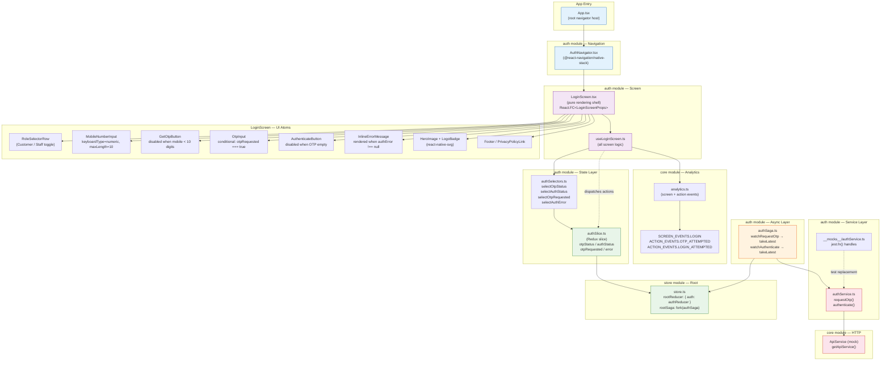
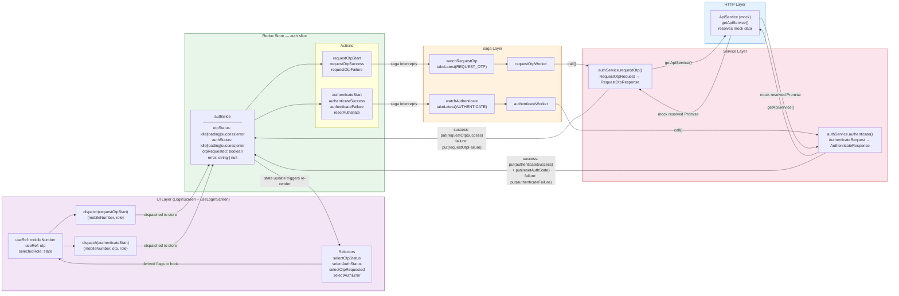
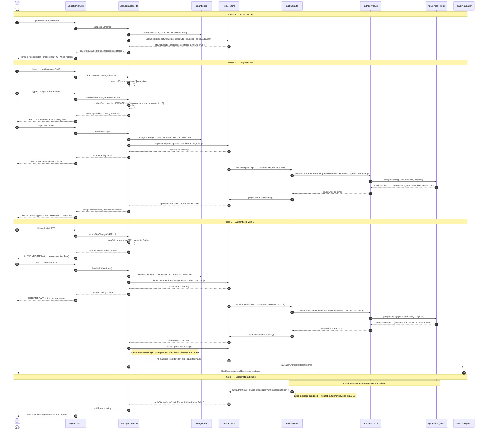

# Architecture Diagrams — FIN-42 Login Screen

**Gate:** SDLC_G1.5_DIAGRAM  
**Feature:** Dummy Login Screen (OTP-based authentication)  
**Module:** `src/auth/`  
**Generated:** 2026-07-17  
**Status:** PASSED

---

## 1. Component Hierarchy Diagram

Shows the full component tree, co-located hook, and module ownership for the LoginScreen feature.

---

## 2. Redux Data Flow Diagram

Shows how state flows from user interaction through the mandatory chain and back to the UI.

**State transition table:**

| User Action        | Dispatched Action                        | `otpStatus` | `authStatus` | `otpRequested` |
| ------------------ | ---------------------------------------- | ----------- | ------------ | -------------- |
| Tap "GET OTP"      | `requestOtpStart`                        | `loading`   | `idle`       | `false`        |
| Saga: OTP success  | `requestOtpSuccess`                      | `success`   | `idle`       | **`true`**     |
| Saga: OTP failure  | `requestOtpFailure`                      | `error`     | `idle`       | `false`        |
| Tap "AUTHENTICATE" | `authenticateStart`                      | `success`   | `loading`    | `true`         |
| Saga: auth success | `authenticateSuccess` → `resetAuthState` | `idle`      | `idle`       | `false`        |
| Saga: auth failure | `authenticateFailure`                    | `success`   | `error`      | `true`         |

---

## 3. Sequence Diagram — OTP Login Flow

Full end-to-end sequence from user interaction to authenticated state.

---

## Gate Result

| Artifact                   | Path                                                                 | Status       |
| -------------------------- | -------------------------------------------------------------------- | ------------ |
| Module/Component Hierarchy | `pipeline-output/FIN-42/run-001/01-plan/architecture-diagrams.md` §1 | ✅ Generated |
| Redux Data Flow            | `pipeline-output/FIN-42/run-001/01-plan/architecture-diagrams.md` §2 | ✅ Generated |
| OTP Login Sequence         | `pipeline-output/FIN-42/run-001/01-plan/architecture-diagrams.md` §3 | ✅ Generated |

**Gate:** `SDLC_G1.5_DIAGRAM` — **PASSED**  
(Non-blocking — diagrams are informational only)

---

**Tokens (estimated):** ~8k in / ~3k out / ~11k total
